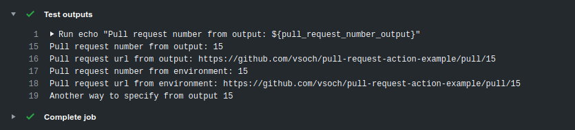

# Automated Branch Pull Requests

This action will open a pull request to master branch (or otherwise specified)
whenever a branch with some prefix is pushed to. The idea is that you can
set up some workflow that pushes content to branches of the repostory,
and you would then want this push reviewed for merge to master.

Here is an example of what to put in your `.github/workflows/pull-request.yml` file to
trigger the action.

```yaml
name: Pull Request on Branch Push
on:
  push:
    branches-ignore:
      - staging
      - launchpad
      - production
jobs:
  auto-pull-request:
    name: PullRequestAction
    runs-on: ubuntu-latest
    steps:
      - name: pull-request-action
        uses: vsoch/pull-request-action@1.0.2
        env:
          GITHUB_TOKEN: ${{ secrets.GITHUB_TOKEN }}
          BRANCH_PREFIX: "update/"
          PULL_REQUEST_BRANCH: "master"
```

## Environment Variable Inputs

Unlike standard actions, this action just uses variables from the environment.

| Name | Description | Required | Default |
|------|-------------|----------|---------|
| BRANCH_PREFIX | the prefix to filter to. If the branch doesn't start with the prefix, it will be ignored | false | "" |
| PULL_REQUEST_BRANCH | open pull request against this branch | false | master |
| PULL_REQUEST_FROM_BRANCH | if a branch isn't found in your GitHub payload, use this branch | false | |
| PULL_REQUEST_BODY | the body for the pull request | false | |
| PULL_REQUEST_TITLE | the title for the pull request | false | |
| PULL_REQUEST_DRAFT | should this be a draft PR? | false | unset |
| MAINTAINER_CANT_MODIFY | Do not allow the maintainer to modify the PR | false | unset |
| PULL_REQUEST_ASSIGNEES | A list (string with spaces) of users to assign | false | unset |
| PULL_REQUEST_REVIEWERS | A list (string with spaces) of users to assign review | false | unset |
| PULL_REQUEST_TEAM_REVIEWERS | A list (string with spaces) of teams to assign review | false | unset |

For `PULL_REQUEST_DRAFT` and `MAINTAINER_CANT_MODIFY`, these are treated as environment
booleans. If they are defined in the environment, they trigger the "true" condition. E.g.,:

 - Define `MAINTAINER_CANT_MODIFY` if you don't want the maintainer to be able to modify the pull request.
 - Define `PULL_REQUEST_DRAFT` if you want the PR to be a draft.

For `PULL_REQUEST_ASSIGNEES`, `PULL_REQUEST_REVIEWERS`, and `PULL_REQUEST_TEAM_REVIEWERS` 
you can provide a string of one or more GitHub usernames (or team names) to
assign to the issue. Note that only users with push access can add assigness to 
an issue or PR, they are ignored otherwise.

The `GITHUB_TOKEN` secret is required to interact and authenticate with the GitHub API to open
the pull request. The example is [deployed here](https://github.com/vsoch/pull-request-action-example) with an example opened (and merged) [pull request here](https://github.com/vsoch/pull-request-action-example/pull/1) if needed.

## Outputs

The action sets a few useful output and environment variables. An output can
be referenced later as `${{ steps.<stepname>.outputs.<output-name> }}`.
An environment variable of course can be referenced as you usually would.

| Name | Description | Environment | 
|------|-------------|-------------|
| pull_request_number |If the pull request is opened, this is the number for it. | PULL_REQUEST_NUMBER |
| pull_request_url |If the pull request is opened, the html url for it. | PULL_REQUEST_URL |
| pull_request_return_code | Return code for the pull request | PULL_REQUEST_RETURN_CODE |
| assignees_return_code | Return code for the assignees request | ASSIGNEES_RETURN_CODE |
| reviewers_return_code | Return code for the reviewers request | REVIEWERS_RETURN_CODE |

See the [examples/outputs-example.yml](examples/outputs-example.yml) for how this works. 
In this example, we can reference `${{ steps.pull_request.outputs.pull_request_url }}`
in either another environment variable declaration, or within a run statement to access
our variable `pull_request_url` that was generated in a step with id `pull_request`.
The screenshot below shows the example in action to interact with outputs in several ways.



## Examples

Example workflows are provided in [examples](examples), and please contribute any
examples that you might have to help other users! We will walk through a basic
example here for a niche case. Let's say that we are opening a pull request on the release event. This would mean
that the payload's branch variable would be null. We would need to define `PULL_REQUEST_FROM`. How would
we do that? We can [set environment variables](https://help.github.com/en/actions/reference/development-tools-for-github-actions#set-an-environment-variable-set-env) for next steps. Here is an example:

```yaml
name: Pull Request on Branch Push
on: [release]
jobs:
  pull-request-on-release:
    name: PullRequestAction
    runs-on: ubuntu-latest
    steps:
      - name: Checkout Code
        uses: actions/checkout@v2
      - name: Derive from branch name
        run: |
            # do custom parsing of your code / date to derive a branch from
            PR_BRANCH_FROM=release-v$(cat VERSION)
            ::set-env name=PULL_REQUEST_FROM_BRANCH::${PR_BRANCH_FROM}
      - name: pull-request-action
        uses: vsoch/pull-request-action@1.0.2
        env:
          GITHUB_TOKEN: ${{ secrets.GITHUB_TOKEN }}
          PULL_REQUEST_BRANCH: "master"
```

The above workflow is triggered on a release, so the branch will be null in the GItHub
payload. Since we want the release PR to come from a special branch, we derive it
in the second step, and then set the `PULL_REQUEST_FROM_BRANCH` variable in the environment
for the next step. In the Pull Request Action step, the pull request
will be opened from `PULL_REQUEST_FROM_BRANCH` against `PULL_REQUEST_BRANCH`, which is
master. If we do not set this variable, the job will exit in an error,
as it is not clear what action to take.


## Example use Case: Update Registry

As an example, I created this action to be intended for an 
[organizational static registry](https://www.github.com/singularityhub/registry-org) for container builds. 
Specifically, you have modular repositories building container recipes, and then opening pull requests to the 
registry to update it. 

 - the container collection content should be generated from a separate GitHub repository, including the folder structure (manifests, tags, collection README) that are expected.
 - the container collection metadata is pushed to a new branch on the registry repository, with namespace matching the GitHub repository, meaning that each GitHub repository always has a unique branch for its content.
 - pushing this branch that starts with the prefix (update/<namespace>) triggers the GitHub actions to open the pull request.

If the branch is already open for PR, it updates it. Take a look at [this example](https://github.com/singularityhub/registry-org/pull/8)
for the pull request opened when we updated the previous GitHub syntax to the new yaml syntax. Although this
doesn't describe the workflow above, it works equivalently in terms of the triggers.
